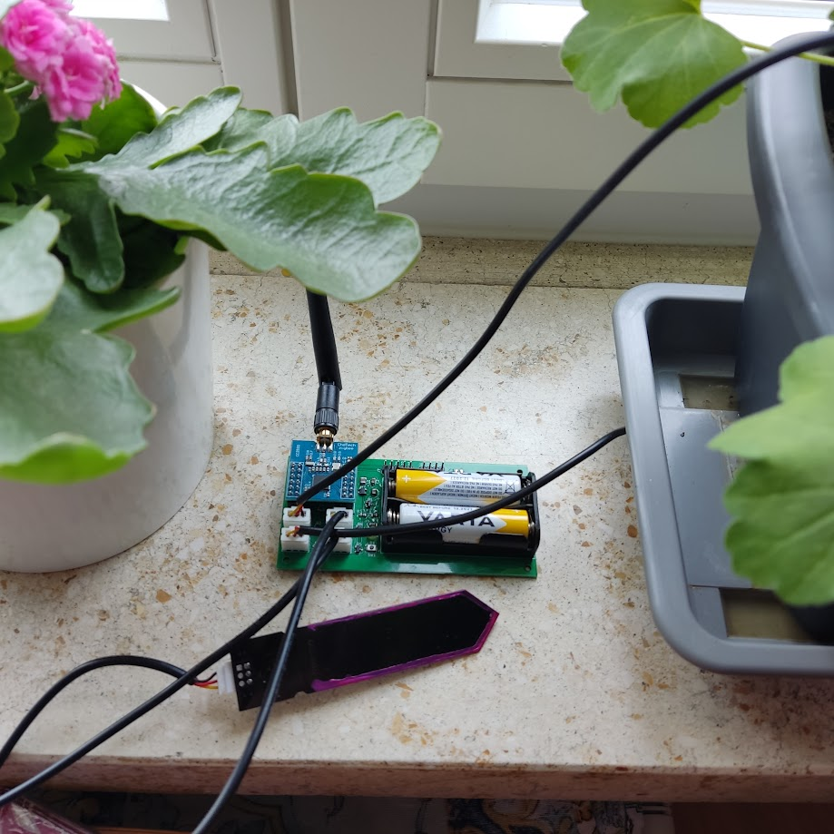
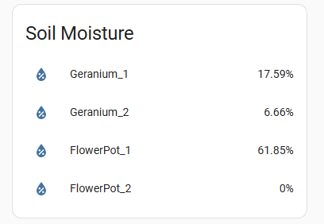

# Intro
ZigMo is a 4 channel Zigbee soil moisture meter.  The project pursues 2 goals:
* Hardware: Attempt some very basic electric engineering and build a Zigbee device based on a custom PCB.
* Software: Write a custom firmware for the device that would make the Zigbee thing work.  

# Description
The concept is pretty simple. It is a Zigbee end device with 4 capacitive wire connected moisture sensors that you could stick into 4 nearby flower pots and monitor moisture levels in all of them with a single device.

This is what it looks like in Home Assistant:

The device is based on a popular CC2530 module that can be bought off Aliexpress for about $3. Custom PCB part handles battery power, routes connections to individual moisture sensors, provides debug connectors and implements user interface - a LED and a button.

# Build notes
### PCB:
The PCB was designed in KiCad and then ordered from JLCPCB. All parts are common and can be ordered from your favorite parts supplier.

**Note**: I know nothing about electric engineering and have no experience with PCB design. I just watched some video on Youtube on how to do it.

### Firmware:
The firmware is based on Zstack 3.0.2. It simply queries the moisture sensors and measures battery voltage every 5 minutes.

ZStack SDK is available for free from Texas Instruments. It contains several examples and even a guide on how to branch your own project off one of those examples (Z-Stack 3.0 Sample Application User's Guide.pdf). 
The most challenging part IMO is getting the IDE/Compiler. ZStack 3.0.2 applications should be built using IAR studio for 8051 processors version 10.20. This IDE is not free, however a free trial is available. You may find other ways of getting it if you search hard enough.

# See also
- Book: Drew Gislason - "Zigbee Wireless Networking"
- Very cool and super detailed series of posts on how to build a Zigbee device from scratch based on the NXP Zigbee stack: https://github.com/grafalex82/hellozigbee
- A bunch of ZStack Zigbee projects built at very professional level: https://github.com/diyruz
